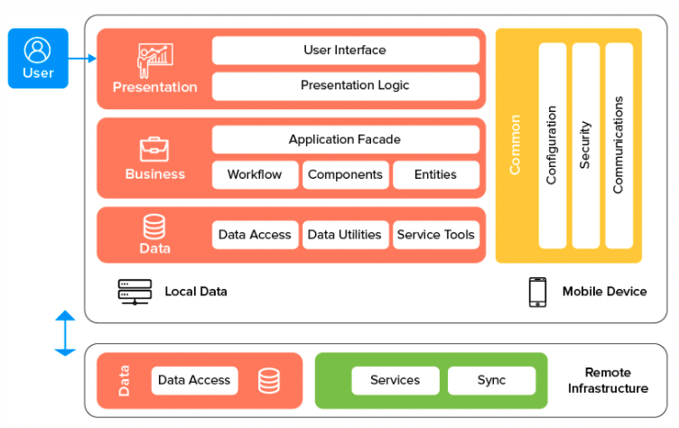

# Shzzz

A "boring" Todo application that works.

## Index

- [Project Structure](#project-structure)
- [App Features](#app-features)
- [Technology](#technology)
- [Installation](#installation)
- [Upcoming Feature](#upcoming-feature)

## Project Structure

The app uses `Getx` to manage State, Navigation and Dependency Injection.

There are 3 layers to the app:
- Data layer: Provides data from local database
- Business layer: Manages CRUD interaction between the `Presentation` and `Data` layer through a `Repository` class
- Presentation layer: Presents the data and handles user interaction with the app

### App Features

- Create new todo item
- Update existing todo item
- Mark new todo item as completed
- Change app theme between Light and Dark
- Change app's language
- Display statistics such as total completed/ ongoing todos
- Show chart display trends of user's tasks

### Technology

Flutter: 2.8.1 (channel `stable`)
Dart: 2.15.1

### Installation

To run the app:
- Make sure you are on the correct version of `Flutter` and `Dart`
- Run `flutter pub get`
- Run `flutter run`

To run the tests:
- Run `flutter test`

## Upcoming Feature

- Background image, avatar image upload with Firebase
- Mark as favorite
- Session management with Firebase